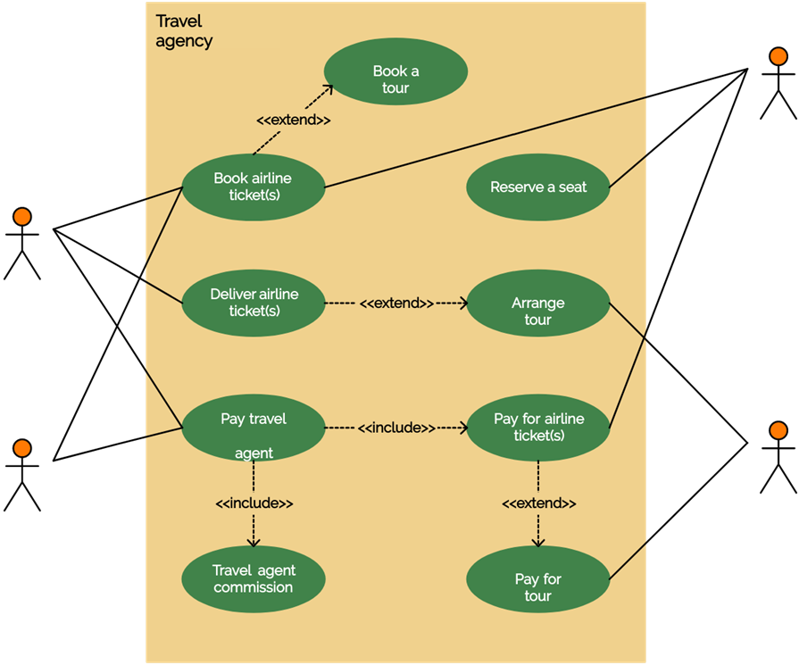

# Course Project Topic - Travel Agency  

<kbd>GitHub</kbd>
[GitHub](https://github.com/nurmoohamedi/travelServiceOnSpring)
- - - -

## Description

This project is aimed to creating service for Travelling purposes. 

Project's idea is make simple and effective website and to act as an agent, selling travel products and services on behalf of a supplier.

**Functionalities:**

* Provide information and expertise
* Recommend destinations, products and services best suited to the needs of the client
* Establish good relationship with clients and vendors.

**There’s  two roles:**
* User
    * book airline tickets
    * book a tour
    * deliver airline tickets
    * pay travel agent

* Admin
  * Site management
  *	Technical suport
  *	Manage site content

Endpoints of user:

* User can create account if he is new in this site;
* User can update informations and manage;
* User change password;
* Delete account;
* Book and buy ticket;
* Book tour;
* See all information about service, travel places;

**Use-case/class diagrams:**

