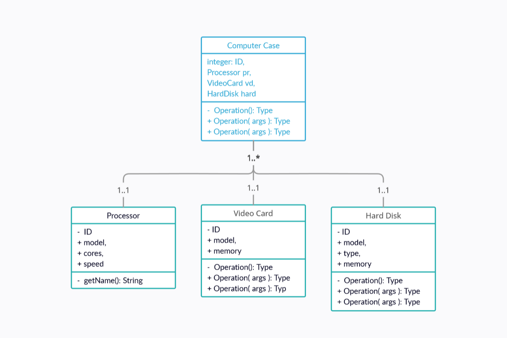

# Course Project Topic - Computer Shop / TechStore  

<kbd>GitHub</kbd>
[GitHub](https://github.com/nurmoohamedi/travelServiceOnSpring)
- - - -

## Description
This Computer Store project is aimed to creating service for selling and helping purposes.
The idea of the project is to create a simple and efficient website to help customers
assemble the best, powerful and high-quality, latest-model computers.

###Functionalities:

* Provide information and expertise
* Recommend destinations, products and services best suited to the needs of the client
* Establish good relationship with clients and vendors.

###There’s three types of users/roles:
* Client
    * purchase
    * make an order
    * consultation
  
* Admin
  * Site management
  * Technical suport
  * Manage site content
  
* Dealer
  * manage data
  * accept orders
  

### Endpoints of user:

* User can create account if he is new in this site;
* User can update informations and manage;
* User change password;
* Delete account;
* Book and buy ticket;
* Book tour;
* See all information about service, travel places;

### Use-case/class diagrams:

